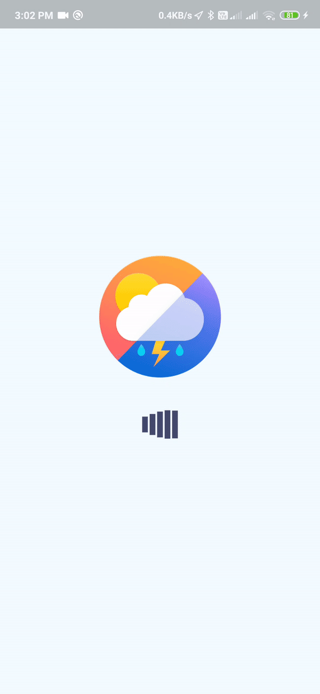

# Weather Forecasting Application

A basic weather forecasting application which retrieves and visualises the weather for next six days based on your current location. The main catch of this application is it's UI.

## Programming Concepts
1. Asynchronous Programming with Dart
2. Dart component's lifecycle methods
3. Dynamic DataTypes
4. Getting User's current location.
5. API Calls with Dart.
7. Object Oriented Programming

## Tools and Tech
Design Inspiration: [Outcrowd](https://dribbble.com/shots/6932038-Mobile-application-Weather-Forecast)

Environment: Android Studio

SDK: Flutter

Programming Language: Dart

API: [OpenWeatherMaps API](https://openweathermap.org/api)

## TODO
1. Dark Theme
2. Documentation

## Screenshot

